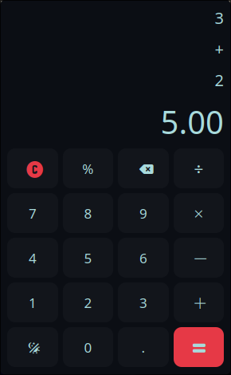

# Proyecto Calculadora Python

<p align="center">
  
</p>


<p align="center">
  
  
  
</p>


## Descripción General

**Proyecto Calculadora Python** es una aplicación de calculadora de escritorio construida con Python y el framework CustomTkinter (basado en Tkinter) para su interfaz gráfica de usuario. Ofrece operaciones aritméticas estándar con alta precisión y mantiene un historial de cálculos. El proyecto enfatiza una arquitectura limpia y modular, haciéndola fácil de entender y mantener.

## Capturas de Pantalla

### Interfaz Principal
<p align="center">
  
</p>
*Vista principal de la calculadora con botones numéricos y operaciones básicas*


## Características

*   **Interfaz Gráfica de Usuario (GUI):** Interfaz intuitiva y responsiva impulsada por CustomTkinter.
*   **Operaciones Aritméticas Estándar:**
    *   Suma (+)
    *   Resta (-)
    *   Multiplicación (×)
    *   División (÷)
    *   Porcentaje (%)
*   **Cálculos de Alta Precisión:** Utiliza el módulo `decimal` de Python para asegurar precisión, especialmente importante para cálculos financieros o científicos.
*   **Historial Persistente de Cálculos:** Guarda automáticamente el historial de cálculos en una base de datos SQLite local, permitiendo a los usuarios revisar operaciones pasadas.
*   **Arquitectura Modular:** Separación bien definida de responsabilidades entre la interfaz de usuario, la lógica de cálculo y las capas de persistencia de datos.

## Inicio Rápido

```bash
# Clonar el repositorio
git clone <url-del-repositorio>
cd proyecto-calculadora-python

# Instalar uv (si no lo tienes)
curl -LsSf https://astral.sh/uv/install.sh | sh
export PATH="$HOME/.cargo/bin:$PATH"

# Crear entorno virtual e instalar dependencias
uv venv
source .venv/bin/activate # En Windows: .venv\Scripts\activate
uv pip install -e .

# Ejecutar la aplicación
python main.py
```

## Descripción de la Arquitectura

La aplicación está diseñada con un enfoque modular, con componentes clave que incluyen:

*   **`AppCalculator`**: El orquestador principal de la aplicación. Inicializa la UI y la conexión a la base de datos, actuando como una Fachada para simplificar el proceso de inicio.
*   **Componentes de UI (`InterfaceCreator`, `ButtonsCreator`, `ScreensCreator`)**: Estas clases son responsables de construir y manejar los diversos elementos de la interfaz gráfica basada en PyQt.
*   **`Calculator`**: Una clase utilitaria sin estado que proporciona métodos estáticos para todas las operaciones aritméticas. Utiliza `Decimal` para precisión y `lru_cache` para optimización de rendimiento.
*   **`HistoryManager`**: Maneja todas las interacciones con la base de datos SQLite para almacenar y recuperar el historial de cálculos. Está implementado como un Singleton para asegurar una sola conexión a la base de datos.
*   **`HistoryTableDB`**: Un Objeto de Transferencia de Datos (DTO) utilizado para manejar registros del historial.

Se emplean varios patrones de diseño para mejorar la estructura y mantenibilidad del código:
*   **Patrón Fachada**: Utilizado por `AppCalculator` para proporcionar una interfaz simplificada a los subsistemas complejos de inicialización de UI y base de datos.
*   **Patrón Singleton**: Asegura que `HistoryManager` tenga solo una instancia, gestionando el acceso a la base de datos de forma centralizada.
*   **Clase Utilitaria Sin Estado**: La clase `Calculator` agrupa funciones aritméticas relacionadas sin mantener ningún estado interno.

## Stack Tecnológico

*   **Lenguaje de Programación:** Python (versión 3.8 o superior)
*   **Framework GUI:** CustomTkinter (basado en Tkinter)
*   **Gestor de Dependencias:** uv
*   **Base de Datos:** SQLite (a través del módulo integrado `sqlite3` de Python)
*   **Aritmética de Precisión:** Módulo `decimal` de Python
*   **Caché:** `functools.lru_cache` para optimizar cálculos

## Prerrequisitos

Antes de ejecutar la aplicación, asegúrate de tener instalado lo siguiente:

*   Python 3.8 o más reciente
*   uv (gestor de paquetes y entorno virtual)

## Instalación

1.  **Clonar el repositorio (si aplica):**
    ```bash
    git clone <url-del-repositorio>
    cd <directorio-del-repositorio>
    ```
    Si tienes los archivos localmente, navega al directorio raíz del proyecto.

2.  **Instalar uv (si no lo tienes):**
    ```bash
    curl -LsSf https://astral.sh/uv/install.sh | sh
    # Asegúrate de que uv esté en tu PATH. Por ejemplo, para bash/zsh:
    # export PATH="$HOME/.cargo/bin:$PATH"
    ```

3.  **Crear entorno virtual e instalar dependencias:**
    ```bash
    uv venv
    source .venv/bin/activate # En Windows: .venv\Scripts\activate
    uv pip install -e .
    ```

## Uso

Para ejecutar la aplicación calculadora, ejecuta el script principal desde el directorio raíz del proyecto:

```bash
python main.py
```
*(Asumiendo que tu script principal de la aplicación es `main.py`. Por favor ajusta si tiene un nombre diferente, ej., `app.py`)*

### Operaciones Básicas
- **Números:** Haz clic en los botones numéricos para ingresar números
- **Operaciones:** Usa +, -, ×, ÷ para operaciones básicas
- **Porcentaje:** Usa el botón % para cálculos de porcentaje
- **Historial:** Accede al historial desde el menú Ver > Historial

## Estructura del Proyecto

```
.
├── main.py                 # Script principal de la aplicación
├── pyproject.toml          # Configuración del proyecto y dependencias (PEP 621)
├── src/                    # Directorio del código fuente
│   ├── core/               # Lógica de negocio y cálculo
│   ├── database/           # Gestión de base de datos
│   └── ui/                 # Componentes de interfaz de usuario
├── docs/                   # Documentación del proyecto
│   ├── index.md
│   └── calculator.svg      # Ícono del proyecto
├── tests/                  # Pruebas unitarias
├── .github/                # Configuraciones de GitHub (ej. Workflows de Actions)
├── .gitignore              # Archivos y directorios ignorados por Git
├── LICENSE                 # Archivo de licencia
└── README.md               # Este archivo
```

## Documentación

Este proyecto utiliza MkDocs para generar documentación. Puedes encontrar información detallada sobre clases, métodos y arquitectura en el directorio `docs`.

Para servir la documentación localmente:

1.  **Instalar MkDocs y el tema Material (si no se ha hecho ya, usando uv):**
    ```bash
    uv pip install mkdocs mkdocs-material
    ```
2.  **Servir la documentación:**
    Desde el directorio raíz del proyecto, ejecuta:
    ```bash
    mkdocs serve
    ```
    Esto iniciará un servidor local, y podrás ver la documentación en tu navegador web (usualmente en `http://127.0.0.1:8000`).

Para construir el sitio de documentación estática:
```bash
mkdocs build
```

## Roadmap

### Versión Actual (1.0.6)
- [x] Operaciones aritméticas básicas (+, -, ×, ÷)
- [x] Cálculos de porcentaje
- [x] Historial persistente de cálculos
- [x] Interfaz gráfica con CustomTkinter
- [x] Arquitectura modular
- [x] Binarios precompilados para Linux y Windows (vía GitHub Actions)

### Próximas Versiones
- [ ] **v1.1.0** - Calculadora Python
  - [ ] Temas personalizables (claro/oscuro)
  - [ ] Interfaz para historial de operaciones

## Problemas Conocidos

- **Windows 7**: Puede requerir instalación manual de Visual C++ Redistributable
- **División por cero**: Muestra mensaje de error estándar, considerar implementar manejo más elegante
- **Números muy grandes**: El rendimiento puede verse afectado con números extremadamente grandes (>1000 dígitos)
- **PyQt6**: Algunas importaciones pueden necesitar ajustes menores al migrar desde PyQt5


## Contribución

¡Las contribuciones son bienvenidas! Aquí te explicamos cómo puedes ayudar:

### Proceso de Contribución
1. **Fork** el proyecto
2. Crea una **rama** para tu feature (`git checkout -b feature/CaracteristicaIncreible`)
3. **Commit** tus cambios (`git commit -m 'Agregar CaracteristicaIncreible'`)
4. **Push** a la rama (`git push origin feature/CaracteristicaIncreible`)
5. Abre un **Pull Request**

### Tipos de Contribuciones
- 🐛 **Reportar bugs** - Crea un issue describiendo el problema
- 💡 **Sugerir features** - Propón nuevas características
- 📝 **Mejorar documentación** - Ayuda a hacer la documentación más clara
- 🔧 **Escribir código** - Implementa nuevas funcionalidades o arregla bugs
- 🧪 **Escribir tests** - Mejora la cobertura de pruebas

### Guías de Contribución
- Sigue las convenciones de código Python (PEP 8)
- Escribe tests para nuevas funcionalidades
- Actualiza la documentación cuando sea necesario
- Usa mensajes de commit descriptivos

### Configuración del Entorno de Desarrollo
```bash
# Clonar tu fork
git clone https://github.com/tu-usuario/proyecto-calculadora-python.git
cd proyecto-calculadora-python

# Crear entorno virtual con uv
uv venv
source .venv/bin/activate  # En Windows: .venv\Scripts\activate

# Instalar dependencias de desarrollo (incluye pytest, flake8, pylint, mkdocs)
uv pip install -e .[dev]

# Ejecutar tests
python -m pytest tests/
```


## Licencia

Este proyecto está licenciado bajo la Licencia MIT - consulta el archivo [LICENSE](LICENSE) para más detalles.

### Resumen de la Licencia MIT
- ✅ Uso comercial permitido
- ✅ Modificación permitida
- ✅ Distribución permitida
- ✅ Uso privado permitido
- ❌ Sin garantía
- ❌ El autor no es responsable por daños

## Autores

- **[GUScode | Gustavo Colmenares]** - *Desarrollo inicial y mantenimiento* - [Gustavo9481](https://github.com/Gustavo9481)

## Descargas

Puedes descargar las versiones precompiladas de la calculadora para tu sistema operativo desde la página de [GitHub Releases](https://github.com/Gustavo9481/Calculadora_Python/releases).

*   **Linux:** `calculadora-linux.tar.gz`
*   **Windows:** `calculadora-windows.zip`

## Agradecimientos

- Inspirado por la calculadora estándar de Android.
- Iconos proporcionados por [Phosphoricons](https://phosphoricons.com)
- Documentación mejorada gracias a [MkDocs Material](https://squidfunk.github.io/mkdocs-material/)
- Comunidad de Python por las excelentes librerías utilizadas


---

<p align="center">
  <strong>¿Te gusta el proyecto? ¡Dale una ⭐ en GitHub!</strong>
</p>

<p align="center">
  Hecho con ❤️ por la comunidad de desarrolladores Python
</p>
