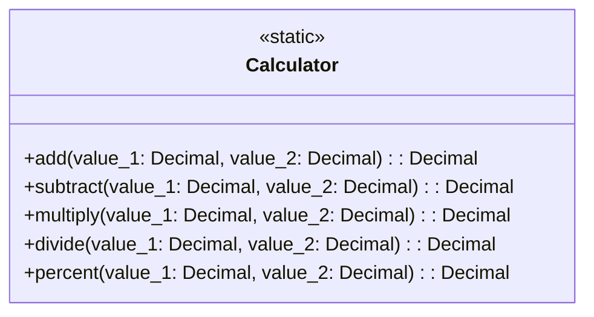

# Clase `Calculator`

La clase **`Calculator`** proporciona métodos estáticos para realizar operaciones aritméticas básicas con alta precisión, utilizando el tipo `Decimal` para garantizar la exactitud en los cálculos.

---

## Funcionalidad

- **Operaciones de Alta Precisión**: Realiza sumas, restas, multiplicaciones, divisiones y cálculos de porcentaje.
- **Seguridad en Hilos (`Thread-Safe`)**: Todos los métodos son seguros para ser utilizados en entornos con múltiples hilos.
- **Optimización con Caché**: Utiliza el decorador `lru_cache` para almacenar en caché los resultados de los cálculos, lo que mejora el rendimiento al evitar recalcular operaciones repetidas.
- **Precisión Decimal**: La precisión de los cálculos está configurada a 28 dígitos para manejar números grandes y decimales con exactitud.

---

## Métodos Estáticos

Todos los métodos de esta clase son estáticos, lo que significa que no es necesario crear una instancia de `Calculator` para utilizarlos.

### `add(value_1: Decimal, value_2: Decimal) -> Decimal`
Suma dos valores decimales.

### `subtract(value_1: Decimal, value_2: Decimal) -> Decimal`
Resta dos valores decimales.

### `multiply(value_1: Decimal, value_2: Decimal) -> Decimal`
Multiplica dos valores decimales.

### `divide(value_1: Decimal, value_2: Decimal) -> Decimal`
Divide dos valores decimales. Lanza una excepción `ZeroDivisionError` si el divisor es cero.

### `percent(value_1: Decimal, value_2: Decimal) -> Decimal`
Calcula el porcentaje de un valor con respecto a otro.

---

## Diagrama UML



---

## Ejemplo de Uso

Debido a que los métodos son estáticos, se pueden llamar directamente desde la clase:

```python
from decimal import Decimal
from core.calculator import Calculator

resultado = Calculator.add(Decimal('10.5'), Decimal('5.5'))
print(resultado)  # Salida: 16.0
```