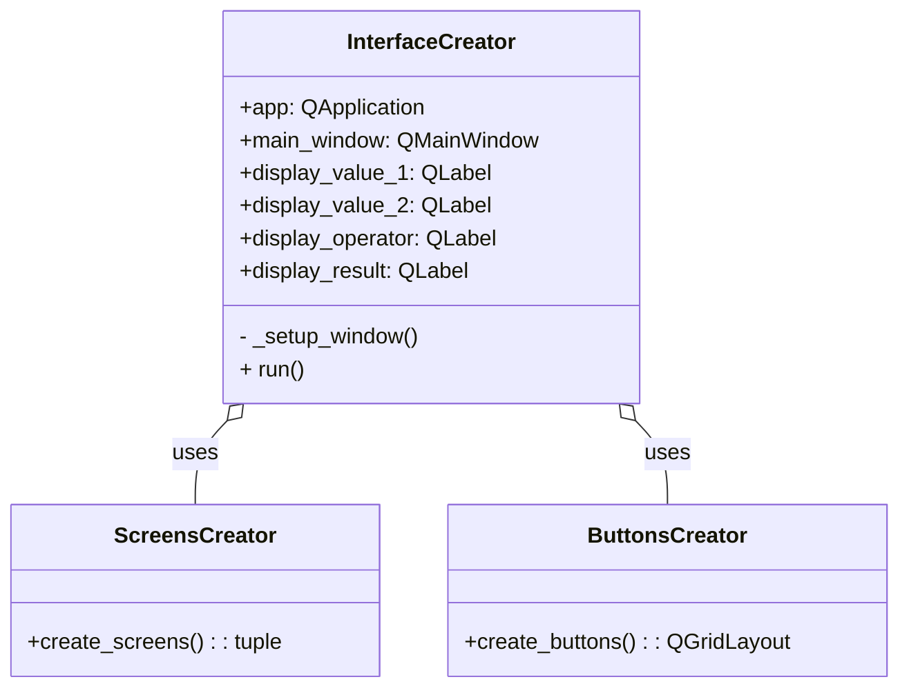

# Clase `InterfaceCreator`

La clase **`InterfaceCreator`** es la responsable de construir y organizar la interfaz gráfica completa de la calculadora. Actúa como un **orquestador**, utilizando otras clases "creadoras" (`ScreensCreator` y `ButtonsCreator`) para generar los componentes de la interfaz y ensamblarlos en la ventana principal.

---

## Funcionalidad

- **Construcción de la Interfaz**: Crea la ventana principal de la aplicación (`QMainWindow`) y configura sus propiedades básicas como el título, el tamaño y el color de fondo.
- **Orquestación de Creadores**: Utiliza `ScreensCreator` para generar las pantallas de la calculadora y `ButtonsCreator` para generar los botones.
- **Organización del Layout**: Organiza las pantallas y los botones en un `QVBoxLayout` para que se muestren de forma ordenada en la ventana.
- **Ejecución de la Aplicación**: Proporciona el método `run()` que inicia el bucle de eventos de Qt y muestra la interfaz al usuario.

---

## Atributos

| Atributo | Tipo | Descripción |
|---|---|---|
| `app` | `QApplication` | Instancia de la aplicación Qt. |
| `main_window` | `QMainWindow` | Ventana principal de la aplicación. |
| `display_value_1` | `QLabel` | Pantalla para el primer valor (obtenida de `ScreensCreator`). |
| `display_value_2` | `QLabel` | Pantalla para el segundo valor (obtenida de `ScreensCreator`). |
| `display_operator` | `QLabel` | Pantalla para el operador (obtenida de `ScreensCreator`). |
| `display_result` | `QLabel` | Pantalla para el resultado (obtenida de `ScreensCreator`). |

---

## Métodos

### `_setup_window()`
Este método privado se encarga de toda la lógica de configuración de la ventana. Crea el widget central, el layout principal, y luego llama a `ScreensCreator` y `ButtonsCreator` para que generen los componentes de la interfaz. Finalmente, añade estos componentes al layout principal.

### `run()`
Este método público inicia la aplicación. Muestra la ventana principal y comienza el bucle de eventos de Qt, que se encarga de procesar las interacciones del usuario (como hacer clic en los botones).

---

## Diagrama UML

