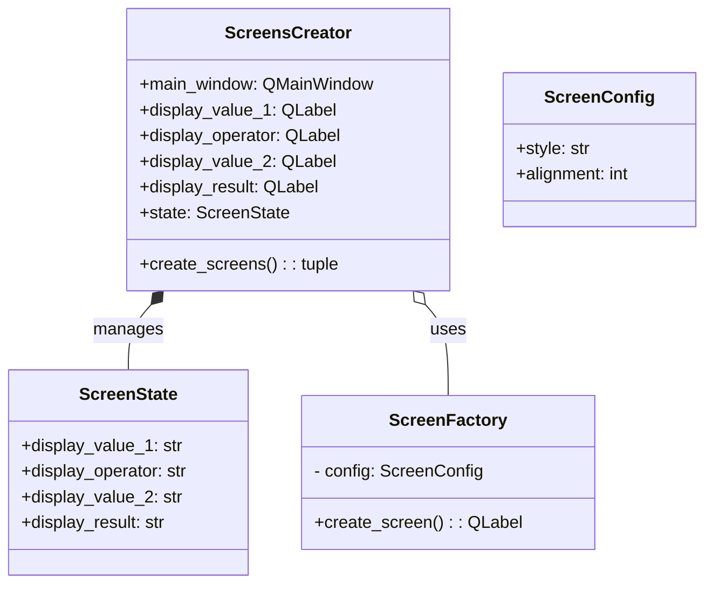

# Clase `ScreensCreator`

La clase **`ScreensCreator`** se encarga de la creación y gestión de las pantallas (objetos `QLabel`) de la interfaz de la calculadora. Utiliza el patrón de diseño **Factory** para crear las pantallas con diferentes estilos.

---

## Funcionalidad

- **Creación de Pantallas**: Genera las cuatro pantallas de la calculadora: para el primer valor, el operador, el segundo valor y el resultado.
- **Patrón Factory**: Utiliza una clase interna `ScreenFactory` para crear instancias de `QLabel` con una configuración específica (estilo, alineación, etc.). Esto permite desacoplar la creación de las pantallas de su gestión.
- **Gestión del Layout**: Organiza las pantallas en un `QVBoxLayout` para que se muestren de forma vertical en la interfaz.

---

## Clases Internas

### `ScreenConfig`
Es un modelo de Pydantic que valida la configuración de las pantallas, asegurando que los parámetros como el estilo y la alineación sean correctos.

### `ScreenState`
Es un modelo de Pydantic que gestiona el estado de las pantallas, almacenando los valores que se muestran en cada una de ellas.

### `ScreenFactory`
Es una clase que actúa como una "fábrica" de pantallas. Se inicializa con un estilo CSS y su método `create_screen()` devuelve un objeto `QLabel` configurado con ese estilo.

---

## Atributos

| Atributo | Tipo | Descripción |
|---|---|---|
| `main_window` | `QMainWindow` | Ventana principal de la aplicación. |
| `display_value_1` | `QLabel` | Pantalla para el primer valor. |
| `display_operator` | `QLabel` | Pantalla para el operador. |
| `display_value_2` | `QLabel` | Pantalla para el segundo valor. |
| `display_result` | `QLabel` | Pantalla para el resultado. |
| `state` | `ScreenState` | Estado de las pantallas. |

---

## Métodos

### `create_screens() -> tuple`
Este es el método principal de la clase. Crea las cuatro pantallas de la calculadora utilizando las factorías de pantallas (`ScreenFactory`), las añade a un layout vertical y devuelve una tupla con el layout y las referencias a las cuatro pantallas. Esta tupla es utilizada por `InterfaceCreator` para configurar el resto de la aplicación.

---

## Diagrama UML

