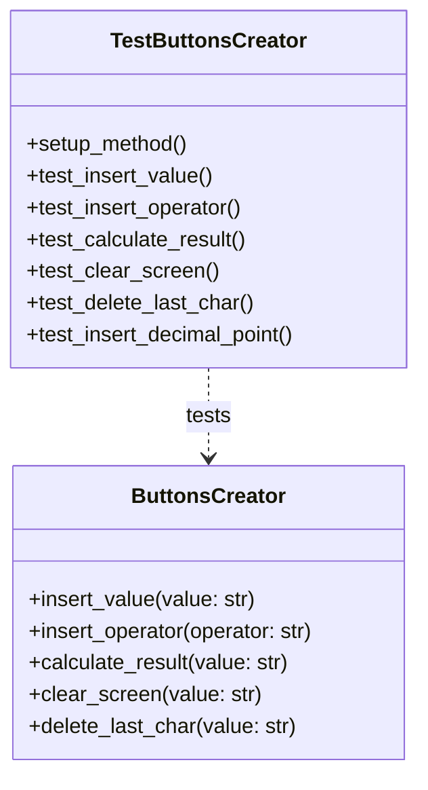

# Pruebas de `TestButtonsCreator`

La clase **`TestButtonsCreator`** contiene las pruebas unitarias para la clase `ButtonsCreator`. Estas pruebas se centran en verificar que la lógica de la interfaz de usuario (los botones) funcione como se espera, utilizando mocks para simular los componentes de la interfaz gráfica de PyQt.

---

## Funcionalidad de las Pruebas

- **Simulación de la Interfaz (Mocking)**: Se utiliza `pytest-mock` para crear "mocks" (simulacros) de los componentes de la interfaz gráfica como `QWidget` y `QLabel`. Esto permite probar la lógica de `ButtonsCreator` sin necesidad de crear una interfaz gráfica real, lo que hace que las pruebas sean más rápidas y fiables.
- **Verificación de la Lógica de los Botones**: Se comprueba que al llamar a los métodos de `ButtonsCreator` (como `insert_value`, `insert_operator`, etc.), el estado de la calculadora (`CalculatorState`) se actualice correctamente y que los `QLabel` (las pantallas) muestren la información esperada.
- **Pruebas de Casos Límite**: Se prueban escenarios como la inserción de múltiples puntos decimales, el cálculo con valores vacíos y la limpieza de la pantalla.

---

## Métodos de Prueba

### `test_insert_value()`
Verifica que al insertar valores numéricos, el `display_value_1` se actualice correctamente.

### `test_insert_operator()`
Verifica que al insertar un operador, el `display_operator` se actualice correctamente.

### `test_calculate_result()`
Verifica que al llamar a `calculate_result`, se realice el cálculo correctamente, se actualice el `display_result` y se guarde la operación en el historial.

### `test_clear_screen()`
Verifica que al llamar a `clear_screen`, todos los `displays` se limpien y el estado de la calculadora se reinicie.

### `test_delete_last_char()`
Verifica que al llamar a `delete_last_char`, se elimine el último carácter del valor actual.

### `test_insert_decimal_point()`
Verifica que solo se pueda insertar un punto decimal por número.

---

## Diagrama UML de Pruebas

