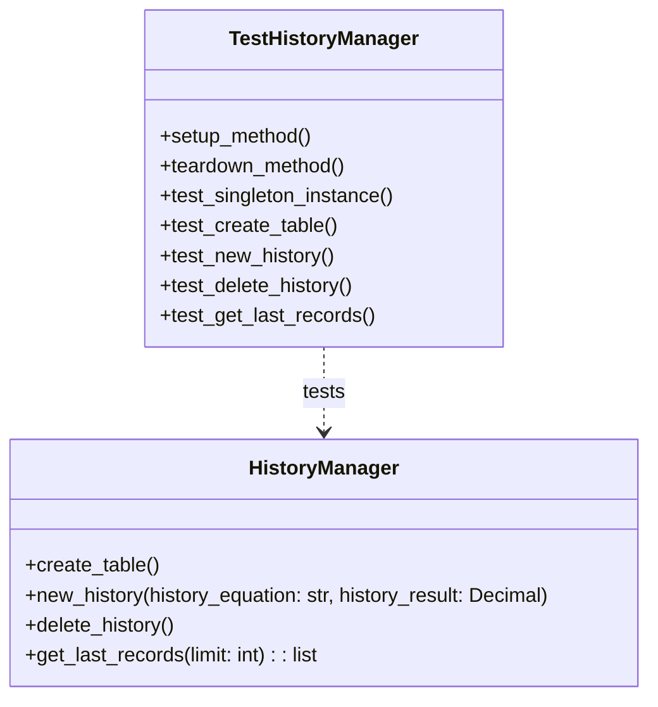

# Pruebas de `TestHistoryManager`

La clase **`TestHistoryManager`** contiene las pruebas unitarias para la clase `HistoryManager`. Estas pruebas aseguran que la interacción con la base de datos (crear la tabla, añadir nuevos registros, eliminar el historial y obtener los últimos registros) funcione de manera fiable.

---

## Funcionalidad de las Pruebas

- **Pruebas de Interacción con la Base de Datos**: Se verifica que los métodos de `HistoryManager` realicen las operaciones CRUD (Crear, Leer, Actualizar, Eliminar) en la base de datos de manera correcta.
- **Uso de una Base de Datos de Prueba**: Las pruebas se ejecutan en una base de datos de prueba separada para no afectar la base de datos de producción. Esto se logra modificando la ruta de la base de datos en la instancia de `HistoryManager` durante las pruebas.
- **Verificación del Patrón Singleton**: Se comprueba que `HistoryManager` siempre devuelva la misma instancia, asegurando que el patrón Singleton esté implementado correctamente.

---

## Métodos de Prueba

### `test_singleton_instance()`
Verifica que al crear dos instancias de `HistoryManager`, ambas sean el mismo objeto.

### `test_create_table()`
Verifica que el método `create_table` se ejecute sin errores.

### `test_new_history()`
Verifica que se pueda añadir un nuevo registro al historial y que los datos se guarden correctamente.

### `test_delete_history()`
Verifica que al llamar a `delete_history`, todos los registros de la tabla se eliminen.

### `test_get_last_records()`
Verifica que se puedan obtener los últimos registros del historial y que los datos sean correctos.

---

## Diagrama UML de Pruebas

